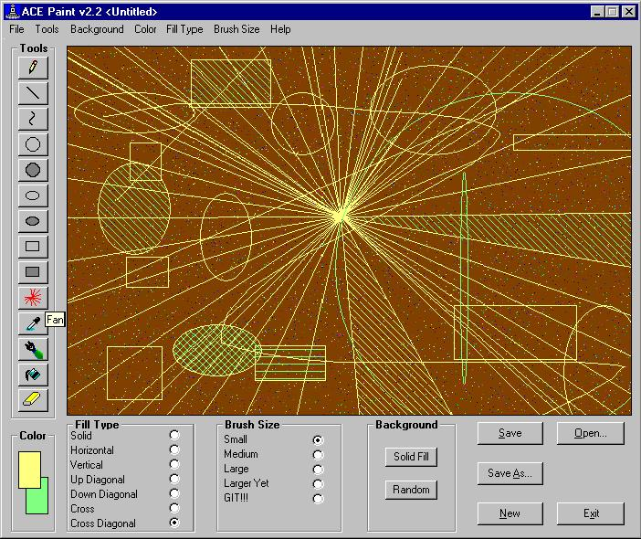



## ACE Paint v2\.2

### Description

Yet another update. In this version, more tools, more features, less bugs. I would appreciate any feedback on this including more ideas on tools and features. Thanks for all the previous feedback.
 
### More Info
 

             |
---                |---
**Submitted On**   |2002-09-30 10:59:44
**By**             |[Gene Shoykhet](https://github.com/Planet-Source-Code/PSCIndex/blob/master/ByAuthor/gene-shoykhet.md)
**Level**          |Beginner
**User Rating**    |3.8 (19 globes from 5 users)
**Compatibility**  |VB 4\.0 \(32\-bit\), VB 5\.0, VB 6\.0
**Category**       |[Graphics](https://github.com/Planet-Source-Code/PSCIndex/blob/master/ByCategory/graphics__1-46.md)
**World**          |[Visual Basic](https://github.com/Planet-Source-Code/PSCIndex/blob/master/ByWorld/visual-basic.md)
**Archive File**   |[ACE\_Paint\_13862293020\.zip](https://github.com/Planet-Source-Code/gene-shoykhet-ace-paint-v2-2__1-39391/archive/master.zip)

### API Declarations

extFloodFill

